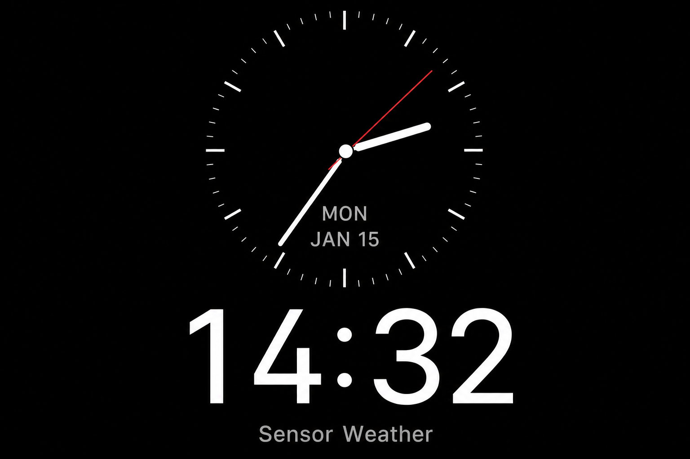
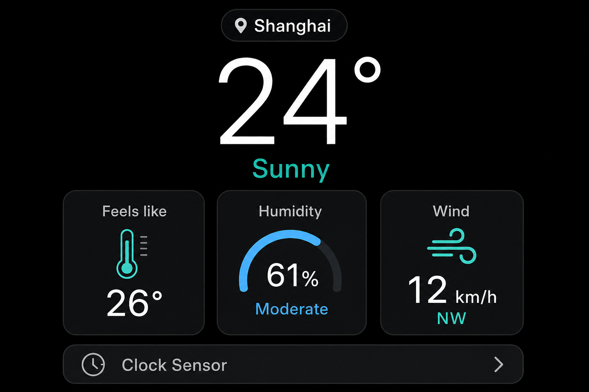
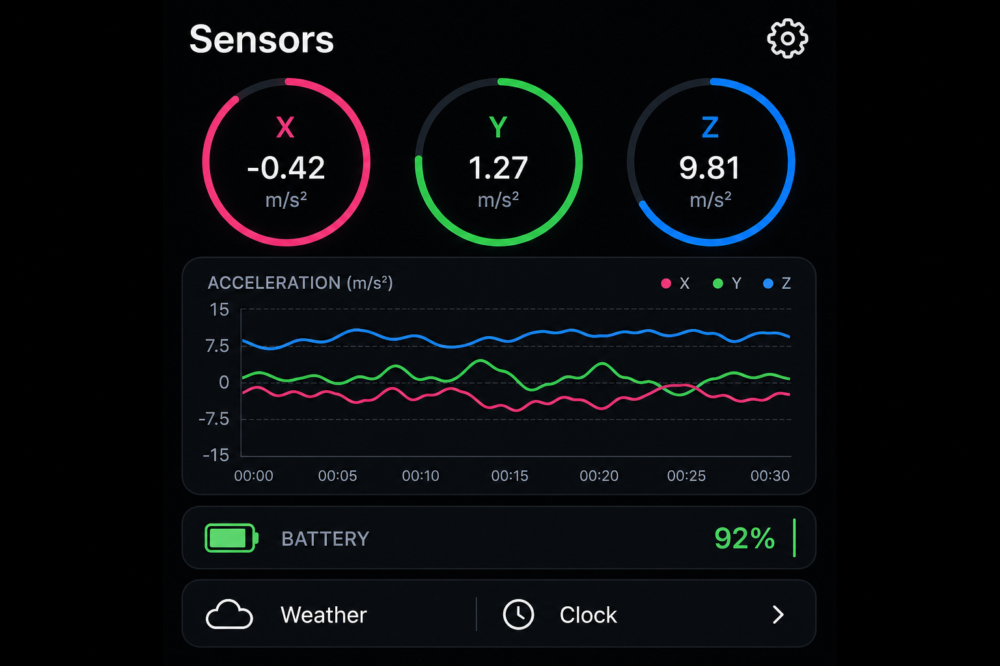

# 桌面摆件（ESP32-S3 Touch AMOLED 1.8）

基于 **ESP32-S3** 与 **LVGL v9** 的小型桌面设备固件：三屏滑动界面、Web 配网与参数管理、RTC + NTP 校时、OpenWeather 天气、IMU 传感器与自动旋转等。

## 界面预览

  
  &nbsp;
  
  &nbsp;
  

时钟 · 天气 · 传感器 — 文件位于 <code>docs/images/</code>，可替换同名 PNG 为实机截图。

## 功能概览

| 模块 | 说明 |
|------|------|
| **时钟** | PCF85063 RTC，WiFi 连上后 NTP 写入 RTC；Apple Watch 风格表盘 |
| **天气** | OpenWeatherMap，城市 ID / API Key / 更新间隔等在 Web 中配置 |
| **传感器** | QMI8658 加速度/陀螺仪、AXP2101 电量等展示 |
| **交互** | 左右滑动切屏；横竖屏由 IMU 检测，稳定后旋转 UI |
| **网络** | 无有效 WiFi 时进入 AP 配网；STA 下浏览器访问 `http://设备IP` 管理 |
| **电源** | 可配置自动息屏、摇一摇唤醒、整点横幅提示 |
| **OTA** | Web 后台提供固件上传升级（见 `web_config.h`） |

## 硬件与引脚

目标板型：**ESP32-S3-Touch-AMOLED-1.8**（368×448 AMOLED + FT3168 触摸 + QMI8658 + PCF85063 + AXP2101 等，见 `pin_config.h`）。

## 开发环境（Arduino IDE）

1. 开发板：**ESP32S3 Dev Module**  
2. 建议分区：**16M Flash (3MB APP)** 等与固件体积匹配的分区表  
3. **PSRAM：OPI**（全帧缓冲与旋转缓冲使用 PSRAM）  
4. **USB CDC：Enabled**（串口日志）

### 依赖库（库管理器 / 手动）

- **GFX Library for Arduino**（SH8601 等）  
- **Arduino_DriveBus_Library**（触摸 I2C 总线，部分环境需手动安装）  
- **SensorLib**（RTC / IMU）  
- **XPowersLib**（AXP2101）  
- **lvgl**（建议 **v9.5**，与工程内 `lv_conf.h` 一致）  
- **ArduinoJson**  

## 首次配网

1. 若无已保存 WiFi 或连接失败，设备开启热点 **Widget-Setup**（密码 `12345678`）。  
2. 手机或电脑连上该热点后，浏览器打开 **http://192.168.4.1**（设备屏幕亦有提示）。  
3. 在网页中填写家中 WiFi 并保存；成功后设备会切 STA 并可能自动重启。  
4. 在 STA 下用浏览器访问设备在局域网中的 IP（形如 `http://192.168.1.xxx`）继续配置天气、亮度、默认首页、息屏等（配置写入 NVS，命名空间 `widget`）。

## 天气 API

使用 **OpenWeatherMap**：在 Web 后台填写 **API Key** 与城市 **City ID**（可在 OpenWeather 网站查询）。

## 仓库结构（主要文件）

| 文件 | 作用 |
|------|------|
| `desktop_widget.ino` | 入口：硬件初始化、LVGL、WiFi、定时任务、三屏切换与旋转重建 |
| `screen_clock.h` / `screen_weather.h` / `screen_sensor.h` | 三屏 UI（头文件内实现） |
| `wifi_manager.h` | STA / AP、DNS 辅助配网 |
| `web_config.h` + `web_ui.h` | HTTP 服务、JSON API、OTA、内嵌前端 |
| `preferences_manager.h` | `AppConfig` 与 NVS 读写 |
| `weather_client.h` | 天气拉取与解析 |
| `orientation.h` | 根据加速度计稳定姿态切换 `lv_display` 旋转 |
| `display_power.h` | 背光、息屏、摇醒、整点提示 |
| `lv_conf.h` | LVGL 编译配置 |

## 固件版本

Web 状态页与逻辑中的版本字符串以 `web_config.h` 里的 **`FW_VERSION`** 为准；修改后重新编译烧录即可。

## 许可

若未在仓库中另行声明，以项目作者或上游硬件文档的许可为准；使用第三方库时请遵守各自许可证。
